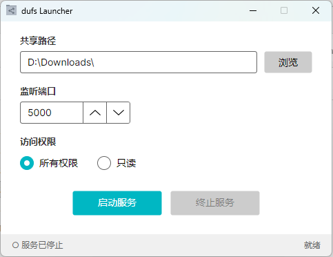

# dufs Launcher

一个简洁的 [dufs](https://github.com/sigoden/dufs) 图形化启动器，让你无需命令行即可快速启动文件共享服务，支持 Windows / Linux / macOS。



## 功能

- 可视化配置共享路径、监听端口和访问权限
- 一键启动 / 停止 dufs 文件服务
- 跟随系统主题（亮色 / 暗色）

## 下载使用

1. 前往 [Releases](../../releases) 页面，下载对应平台的压缩包
2. 解压到任意目录
3. 运行 `dufsLauncher` 即可

> 程序已内置 dufs，无需额外安装。

### 快速上手

1. 点击 **浏览** 选择要共享的文件夹
2. 设置监听端口（默认 `5000`）
3. 选择访问权限：**所有权限**（可上传/删除）或 **只读**
4. 点击 **启动服务**
5. 在浏览器中访问 `http://<主机IP地址>:<端口>` 即可使用

## 构建

需要 [.NET 10 SDK](https://dotnet.microsoft.com/download)。

```bash
cd src/dufsLauncher
dotnet publish -c Release
```

## 致谢

本项目是 [dufs](https://github.com/sigoden/dufs) 的图形化前端。感谢 dufs 提供了如此优秀的文件服务器，dufs Launcher 的一切文件服务能力均由 dufs 驱动。

## 许可证

Apache License 2.0
